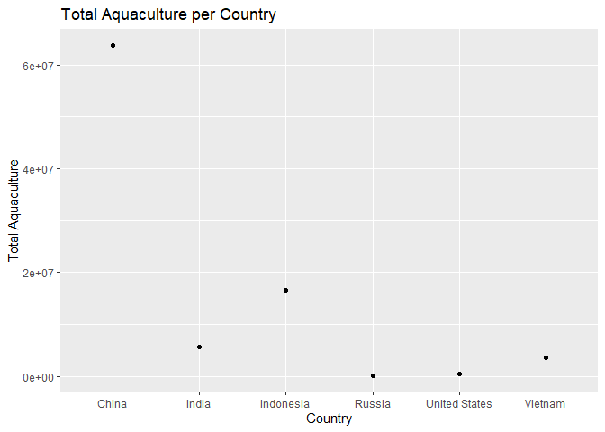
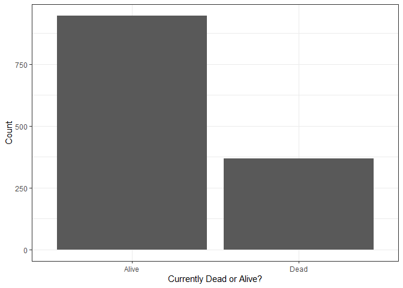
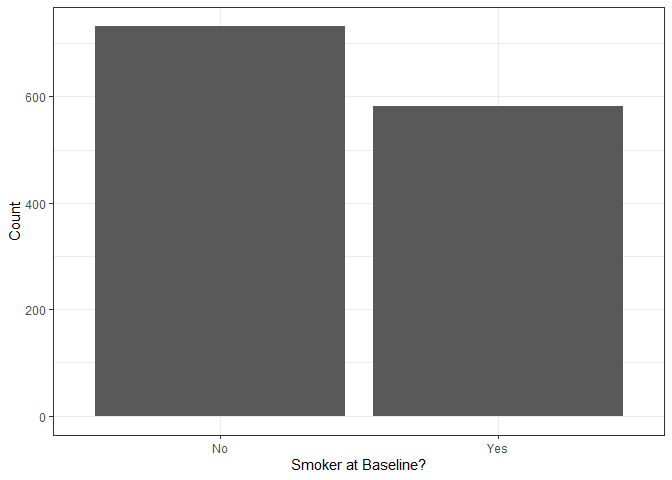
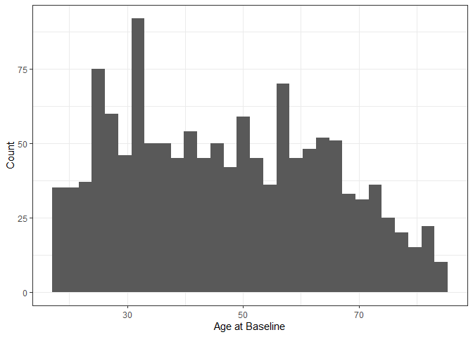
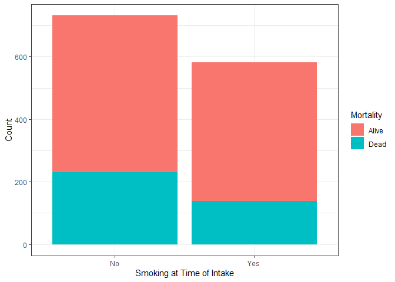
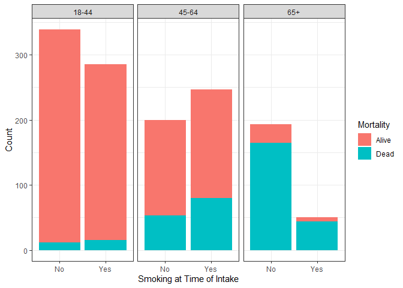

Lab 06 - Ugly charts and Simpson’s paradox
================
Ryan Wheat
02/23/23

### Load packages and data

``` r
library(tidyverse) 
library(dsbox)
library(mosaicData) 
```

``` r
staff <- read_csv("data/instructional-staff.csv")
```

    ## Rows: 5 Columns: 12
    ## ── Column specification ────────────────────────────────────────────────────────
    ## Delimiter: ","
    ## chr  (1): faculty_type
    ## dbl (11): 1975, 1989, 1993, 1995, 1999, 2001, 2003, 2005, 2007, 2009, 2011
    ## 
    ## ℹ Use `spec()` to retrieve the full column specification for this data.
    ## ℹ Specify the column types or set `show_col_types = FALSE` to quiet this message.

### Exercise 1

``` r
staff_long <- staff %>%
  pivot_longer(cols = -faculty_type, names_to = "year") %>%
  mutate(value = as.numeric(value))

#plot long dataframe

staff_long %>%
  ggplot(aes(x = year,
             y = value,
             group = faculty_type,
             color = faculty_type)) +
  geom_line() +
  labs(title = "Instructional Staff Employment Plans", x = "Year", y = "Percentage of Hires", color = "Faculty Type")
```

<!-- -->

### Exercise 2

This graph works, but given the question that we need to answer, I would
collapse the full-time faculty into one category so that there is less
clutter – and the visual can be assessed in terms of full time faculty
vs. part time faculty.

### Exercise 3

These visuals are truly horrendous; I cannot figure out what the
researchers are trying to convey. These are the changes I’d make:

-   Label which color on the plot represents fish captured vs. fish
    farmed in each country.

-   I’m not sure it makes sense to put both of these variables on the
    same graph, becuase the amount of fish farmed in China is so large,
    it makes it hard to tell anything else. So scaling things more
    appropriately for each variable would be useful.

-   On that note, it is really interesting to me that China alone farms
    more fish than the rest of the world combined. To highlight this,
    I’d like to make some sort of visual that compares China’s fish
    farming stats to that of every other country.

(I only did the second change on here, sorry Mason. I’d spend more time
on this but I gotta move on to the next lab)

``` r
fisheries <- read_csv("data/fisheries.csv")
```

    ## Rows: 216 Columns: 4
    ## ── Column specification ────────────────────────────────────────────────────────
    ## Delimiter: ","
    ## chr (1): country
    ## dbl (3): capture, aquaculture, total
    ## 
    ## ℹ Use `spec()` to retrieve the full column specification for this data.
    ## ℹ Specify the column types or set `show_col_types = FALSE` to quiet this message.

``` r
#filter for only the countries that it seems these ppl care about in their graphics

fisheries_filtered <- fisheries %>%
  mutate(new_country = case_when(
    country == "China" ~ "China",
    country == "Indonesia" ~ "Indonesia",
    country == "India" ~ "India",
    country == "Vietnam" ~ "Vietnam",
    country == "United States" ~ "United States",
    country == "Russia" ~ "Russia",
    !country %in% c("China", "India", "Indonesia", "Vietnam", "United States", "Russia") ~ "Other")) %>%
  filter(new_country != "Other")

#plot those six countries

fisheries_filtered %>%
  ggplot(aes(x = new_country, y = capture)) +
  geom_point() +
  labs(title = "Total Fish Captured per Country", x = "Country", y = "Total Fish Captured")
```

<!-- -->

``` r
fisheries_filtered %>%
  ggplot(aes(x = new_country, y = aquaculture)) +
  geom_point() +
  labs(title = "Total Aquaculture per Country", x = "Country", y = "Total Aquaculture")
```

<!-- -->

### Wickham

#### Exercise 1

This seems like observational data, because it seems extremely unethical
to manipulate ppl to be smokers experimentally.

#### Exercise 2

There are 1314 observations. Each observation represents one
participant.

#### Exercise 3

There are 3 variables: outcome, smoking status, and age.

``` r
data("Whickham")

?Whickham
```

    ## starting httpd help server ... done

``` r
library(performance)

#performance::compare_performance()

#plot each variable

Whickham %>%
  ggplot(aes(x = outcome)) +
  geom_bar() + theme_bw() + labs(x = "Currently Dead or Alive?", y = "Count")
```

<!-- -->

``` r
Whickham %>%
  ggplot(aes(x = smoker)) +
  geom_bar() + theme_bw() + labs(x = "Smoker at Baseline?", y = "Count") 
```

<!-- -->

``` r
Whickham %>%
  ggplot(aes(x = age)) +
  geom_histogram() + theme_bw() + labs(x = "Age at Baseline", y = "Count")
```

    ## `stat_bin()` using `bins = 30`. Pick better value with `binwidth`.

<!-- -->

#### Exercise 4

My very novel and revolutionary prediction is that smokers at baseline
will have worse health/mortality outcomes 20 years later.

#### Exercise 5

76% of smoking individuals (at the time of the intake survey) were still
alive 20 years later. 69% of non-smoking individuals were still alive
after 20 years. This pattern of results seems to suggest that smoking
does not decrease life expectancy, and may actually increase life
expectancy – which we know can’t be right.

``` r
#visualization

Whickham %>%
  ggplot(aes(x = smoker, fill = outcome)) + geom_bar() + theme_bw() + labs(x = "Smoking at Time of Intake", y = "Count", fill = "Mortality")
```

<!-- -->

``` r
#conditional probability

Whickham %>%
  count(smoker, outcome) %>%
  group_by(smoker) %>%
  mutate(mortal_prob = n/sum(n))
```

    ## # A tibble: 4 × 4
    ## # Groups:   smoker [2]
    ##   smoker outcome     n mortal_prob
    ##   <fct>  <fct>   <int>       <dbl>
    ## 1 No     Alive     502       0.686
    ## 2 No     Dead      230       0.314
    ## 3 Yes    Alive     443       0.761
    ## 4 Yes    Dead      139       0.239

#### Exercise 6

``` r
#create age category variable

Whickham <- Whickham %>%
  mutate(age_cat = case_when(age <= 44 ~ "18-44",
age > 44 & age <= 64 ~ "45-64",
age > 64 ~ "65+"))
```

#### Exercise 7

In this set of analyses, we’ve accounted for age as a potentially
confounding variable. Indeed, when looking at the effect of smoking on
life expectancy within each age group, participants who smoked at the
time of the intake survey were more likely to be dead than participants
who were not smokers. This seems like a more reasonable pattern of
results.

``` r
#visualization

Whickham %>%
  ggplot(aes(x = smoker, fill = outcome)) + geom_bar() + facet_wrap(~ age_cat) + theme_bw() + labs(x = "Smoking at Time of Intake", y = "Count", fill = "Mortality")
```

<!-- -->

``` r
#conditional probability

Whickham %>%
  count(smoker, age_cat, outcome) %>%
  group_by(smoker, age_cat) %>%
  mutate(mortal_prob = n/sum(n))
```

    ## # A tibble: 12 × 5
    ## # Groups:   smoker, age_cat [6]
    ##    smoker age_cat outcome     n mortal_prob
    ##    <fct>  <chr>   <fct>   <int>       <dbl>
    ##  1 No     18-44   Alive     327      0.965 
    ##  2 No     18-44   Dead       12      0.0354
    ##  3 No     45-64   Alive     147      0.735 
    ##  4 No     45-64   Dead       53      0.265 
    ##  5 No     65+     Alive      28      0.145 
    ##  6 No     65+     Dead      165      0.855 
    ##  7 Yes    18-44   Alive     270      0.947 
    ##  8 Yes    18-44   Dead       15      0.0526
    ##  9 Yes    45-64   Alive     167      0.676 
    ## 10 Yes    45-64   Dead       80      0.324 
    ## 11 Yes    65+     Alive       6      0.12  
    ## 12 Yes    65+     Dead       44      0.88
